# 🛍️ Product Catalog Cache System

Цей проект — RESTful веб-сервіс для управління каталогом продуктів з кешуванням для покращення продуктивності читання.  
Він підтримує CRUD операції над продуктами та використовує сучасні технології для надійності, моніторингу і зручності розробки.

---

## 🚀 Features


- Full CRUD support for products
- Caching 
- - ✅ Single product retrieval
- - ✅ Category-based product lists
 - - ✅ Cache eviction on update/delete
- - ✅ Cache entries expire after 10 minutes
- H2 in-memory database with sample data
- Basic validation and exception handling
- Swagger/OpenAPI documentation
- API Rate Limiting на основі Resilience4j (20 запитів на хвилину на користувача)

---


## 🛠️ Використані технології

| Layer      | Technology                           |
|------------|--------------------------------------|
| Language   | Java 21                              |
| Framework  | Spring Boot 3.2.5                    |
| Caching    | Spring Cache and Caffeine(in-memory) |
| Database   | H2 (in-memory)                       |
| Migration  | Flyway                               |
| Build Tool | Maven                                |
| Testing    | JUnit 5                              |
| Docs       | Swagger / OpenAPI                    |
| Monitoring | Prometheus & Grafana                 |


---


## 📡 API Endpoints


| Method | Endpoint                               | Description                  |
| ------ | -------------------------------------- | ---------------------------- |
| GET    | `/api/v1/products`                     | Get all products (paginated) |
| GET    | `/api/v1/products/{id}`                | Get product by ID            |
| GET    | `/api/v1/products/category/{category}` | Get products by category     |
| POST   | `/api/v1/products`                     | Create a new product         |
| PUT    | `/api/v1/products/{id}`                | Update existing product      |
| DELETE | `/api/v1/products/{id}`                | Delete product by ID         |


---


## 🧠 Caching Strategy
- Spring Cache with in-memory Caffeine


- @Cacheable: applied to product retrieval and category search


- @CacheEvict: on update/delete to remove stale data


- TTL: Entries expire after 10 minutes


## 🛠️ Setup Instructions


### 1. Клонування репозиторію
Для отримання коду виконайте команду:

```bash
git clone https://github.com/rel1c-hub/ProductCatalogueCacheSystem.git
cd ProductCatalogueCacheSystem
```
### 2.1 Запуск через Docker Compose
Переконайтесь, що Docker і Docker Compose встановлені.

```bash
docker compose up --build
```
Це запустить всі сервіси: додаток, H2, Loki, Grafana, Prometheus, Tempo, Alloy тощо.

### 2.2 Локальний запуск без Docker
Потрібні JDK 21+ та Maven:

```bash
mvn clean install
mvn spring-boot:run
```
### 3. Доступ до сервісів моніторингу та документації
Grafana (візуалізація метрик і логів):
- http://localhost:3000/?orgId=1&from=now-6h&to=now&timezone=browser
- (pas:admin/log:admin)

Prometheus (метрики):
- http://localhost:9090

Swagger UI (API документація і тестування):
- http://localhost:8080/swagger-ui.html
### 4. Тестування API за допомогою Postman
Для швидкого тестування API використовуйте Postman. У репозиторії у файлі postman_collection.json знаходиться колекція із основними запитами:

- Список продуктів
- Деталі продукту
- Створення, оновлення і видалення продукту
- Отримання продуктів за категорією

### Щоб імпортувати:

- Відкрийте Postman
- Оберіть Import → File
- Оберіть файл postman_collection.json
### 🔒 Rate Limiting
API обмежено за допомогою Resilience4j:

20 запитів на хвилину

Перевищення ліміту повертає 429 TOO MANY REQUESTS з повідомленням

Обробляється глобальним @ExceptionHandler
### 🔐 Basic Auth

API захищено базовою автентифікацією:

Ім’я користувача: admin, пароль: password

Налаштування в application.properties
### 📊 Cache metrics (hit/miss)

Використовується Spring Actuator + Micrometer

Метрики кешу (cache.gets, cache.misses, cache.puts)

Доступні на /actuator/prometheus, збираються Prometheus

Візуалізація через Grafana Dashboard
Testing
У Features є JUnit 5, але в README не описано, як запустити тести:

### 🧪 Тестування
Для перевірки застосунку запустіть:
````bash 
mvn test  
````
#### Тести охоплюють:

- CRUD операції

- Обробку помилок

- Перевірку кешу

## 🧭 Architecture Diagram



## Процес розробки
Розробку проєкту розпочато з базового CRUD для роботи з продуктами. Основні REST-ендпоінти (GET, POST, PUT, DELETE) були реалізовані швидко, завдяки чіткому розумінню бізнес-логіки та використанню стандартного стеку Spring Boot.

Після створення базового функціоналу фокус було зміщено на оптимізацію читання даних через кешування з використанням Spring Cache та Caffeine. Це стало початком роботи з проблематикою кешу, яку вирішено за допомогою анотацій @Cacheable та @CacheEvict.
### 🧩 Вирішені технічні виклики

| Випробування                                                                                                     | Рішення                                                                                                                                                       |
|------------------------------------------------------------------------------------------------------------------|---------------------------------------------------------------------------------------------------------------------------------------------------------------|
| ❌ **Self-invocation в кешованих методах** — кеш не працював при виклику одного методу з іншого всередині сервісу | 🔄 Створено проксі-обгортку через `ApplicationContext` для виклику кешованих методів ззовні                                                                   | 
| ❌ **Swagger вимагав авторизацію** після додавання Spring Security                                                | 🔐 Додано конфігурацію для дозволу публічного доступу до Swagger UI та `/v3/api-docs/**`                                                                      |
| ❌ **Logbook не завантажував артефакти**                                                                          | ✅ Заміна артефактів на актуальні версії `logbook-core`, `logbook-json`, `logbook-spring-boot-starter`, конфігурація фільтра для логування запитів/відповідей |
| ❌ **Метрики кешу не зчитувались**                                                                                | ✅ Увімкнено `recordStats` у caffeine, інтегровано Spring Boot Actuator та Micrometer                                                                         |
| ❌ **Prometheus/Grafana/Loki інтеграція**                                                                         | ⚙️ Створено складний `docker-compose` стек, налаштовано `alloy` як агент для збору логів, розв’язано конфлікти портів та неправильні шляхи до конфігурацій   |

